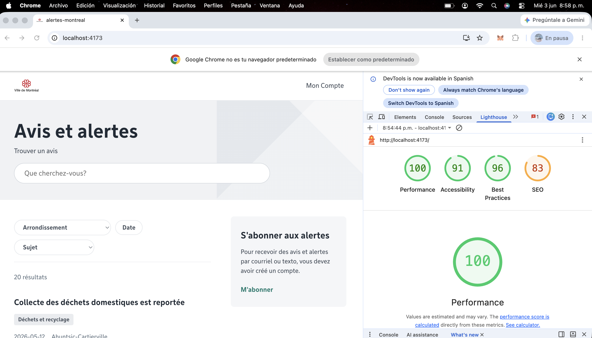

# Projet 2 — Avis et alertes de Montréal

**Étudiant :** Deiby Zapata

## Installation

```bash
npm install
```

## Démarrage

```bash
npm run dev
```

L'application sera accessible à l'adresse `http://localhost:5173`.


## Fonctionnalités PWA

- Application installable sur mobile et bureau
- Fonctionne hors ligne grâce au service worker
- Indicateur visuel quand l'utilisateur est hors ligne
- Données de l'API mises en cache pour un accès sans connexion

## Stratégie de cache

Le service worker utilise la stratégie *Stale While Revalidate* pour les données de l'API de Montréal.

Quand l'utilisateur ouvre l'application :
- Si les données sont en cache → elles s'affichent immédiatement
- En même temps → le service worker va chercher les nouvelles données sur le réseau
- La prochaine fois → les données sont déjà à jour

Les fichiers statiques (JS, CSS, images) sont précachés au premier chargement, ce qui permet d'utiliser l'application hors ligne.

## Choix techniques

**React + Vite** — initialisation rapide du projet avec rechargement automatique pendant le développement.

**react-router-dom** — gestion du routage côté client avec `<Routes>`, `<Route>` et `<Outlet>` pour la mise en page partagée.

**useSearchParams** — les filtres (arrondissement, sujet, date) et la recherche sont stockés dans l'URL. Cela permet de partager ou rafraîchir la page sans perdre les filtres actifs.


**vite-plugin-pwa** — génération automatique du service worker avec stratégie Stale While Revalidate pour les appels API et précache des assets statiques.

**Filtres dynamiques avec chips** — sélection multiple pour les arrondissements et les sujets avec affichage des filtres actifs sous forme de chips supprimables. Logique OR entre les valeurs d'un même filtre, AND entre les filtres.

**CSS vanilla** — un seul fichier `App.css` avec des variables CSS pour les couleurs officielles de la Ville de Montréal.


## Captures Lighthouse


git add .